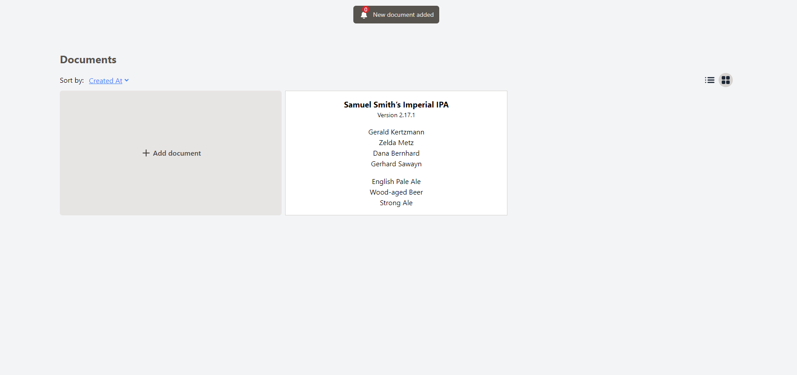

<a id="readme-top"></a>

<!-- PROJECT LOGO -->
<div>
<a href="https://github.com/marcco12/Documentor">
  <h3 align="center">Documentor</h3>
</a>

  <p>
    Documentor is a web application that simulates the creation of documents. Allows you to create, edit, and organize your documents easily with the most basic information (Title, Version, Colaborators and Attachments)
  </p>

Key Features:

<ul>
  <li>
    Create documents with titles, and version.
  </li>
  <li>
    Receive a notification for each document that is "created" by other user.
  </li>
  <li>
    Filter documents by: Name, Version or Date
  </li>
  <li>
    Remove the documents you don't want
  </li>
  <li>
    Enjoy an intuitive and easy-to-use interface.
  </li>
</ul>

<!-- TABLE OF CONTENTS -->
<details>
  <summary>Table of Contents</summary>
  <ol>
    <li>
      <a href="#about-the-project">About The Project</a>
      <ul>
        <li><a href="#built-with">Built With</a></li>
      </ul>
    </li>
    <li><a href="#about-the-project">About The Project</a></li>
    <li>
      <a href="#getting-started">Getting Started</a>
      <ul>
        <li><a href="#prerequisites">Prerequisites</a></li>
        <li><a href="#installation">Installation</a></li>
        <li><a href="#running-the-project">Running the project</a></li>
      </ul>
    </li>
    <li><a href="#contact">Contact</a></li>
  </ol>
</details>

### Built With

The project is built with no framework. Simple HTML, CSS and Typescript. But to make things easier, I used the next tools:

* NodeJS
* Typescript
* Tailwind CSS

<p align="right">(<a href="#readme-top">back to top</a>)</p>

<!-- ABOUT THE PROJECT -->

## About The Project



You can't create a document like you would on Word. It is a simlpe application to simulate the creation of documents and receiving notifications from other users. 

All notifications of other users creating documents are fake.

If you have no documents and reload the web, the backend will serve you with new documents.

<p align="right">(<a href="#readme-top">back to top</a>)</p>

<!-- GETTING STARTED -->

## Getting Started

### Prerequisites

<ul>
  <li>
    <a href="https://nodejs.org/en/download/package-manager/current">
      NodeJS - Min. Version: 20.11.1
    </a>
  </li>
  <li>
    <a href="https://go.dev/">
      GO Runtime
    </a>
  </li>
</ul>

### Installation

1. Clone the repo
    ```sh
    git clone https://github.com/marcco12/Documentor.git
    ```
2. Install NPM packages
    ```sh
    npm install
    ```
3. Run the build process
    ```sh
    npm run build
    ```
### Running the project

1. Start the backend server
    ```sh
    npm run start:backend
    ```
2. Start the frontend server
    ```sh
    npm run start:frontend
    ```

<p align="right">(<a href="#readme-top">back to top</a>)</p>

<!-- CONTACT -->

## Contact

Marcos - mcor.oliveira@gmail.com

Project Link: [https://github.com/marcco12/Documentor](https://github.com/marcco12/Documentor)

<p align="right">(<a href="#readme-top">back to top</a>)</p>

